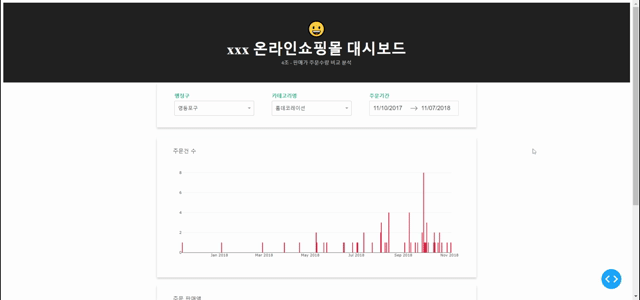

  
<h1 align="center">
  
📊 온라인 쇼핑몰 데이터 분석 및 예측 프로젝트 

  
 </h1>

 
 

## 💡 Introduction

- **개발 기간**
  > 2022.06.23 ~ 2022.06.24

- **개발 환경**
  > Python (dash)

  
  

## 🎨 Development

- **프로젝트 소개**

  > 1개월 Python 데이터 시각화 수강 후 진행한 세 번째 프로젝트

  > 데이터 전처리 및 시각화

  > 이슈 모니터링 대시보드 구현

- **참여 인원**
  >  팀 프로젝트 (7명)

  
  

## ✅ Completion
- **탐색적 데이터 분석**
  > 1.고객 정보
  
  > 2.상품 정보
  
  > 3.주문 정보
  
  > 4.결제 정보

  > 5.환불 정보

  > 6.옵션 정보
  

- **대시보드 구현**

  > 서울지역 구별/카테고리별 주문건수
  
  > 서울지역 구별/카테고리별 주문 판매액 

  
  

## 👏 Evaluation
- **느낀 점**
   > 대시보드 구현이 생각했던 것보다 까다롭고 복잡해서 Python dash보다는 다른 툴을 사용하는 것이 낫겠다는 생각이 들었음

   > 예습한다고 이런저런 패키지를 혼자서 설치하고 수업 시간에 강사와 새로운 패키지를 설치하다 보니 충돌이 발생해서 결국 Jupyter Notebook을 새로 설치해야 했음

   > 코딩보다 더 어려운 것은 환경설정이라는 것을 체험했음

   > 하루 만에 새로운 패키지 사용법을 이해하고 원하는 대로 적용하기에는 시간이 부족했음 